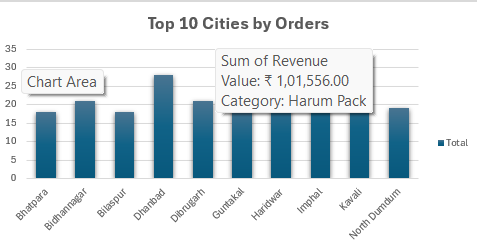

# Project Data Analytics – Excel Dashboard Project

## 📌 Project Overview
This project focuses on analyzing **sales and operational data** using Microsoft Excel to extract actionable business insights.  
The interactive dashboard highlights sales trends, customer demographics, product performance, and other key metrics to help optimize decision-making.

---

## 🎯 Objectives
- Analyze sales performance across multiple dimensions such as products, locations, and time periods.
- Identify key revenue drivers and top-performing categories.
- Provide decision-makers with visually interactive KPIs and charts.
- Spot seasonal trends and customer purchasing behaviors.

---

## 📊 Key Features & KPIs
The dashboard includes the following Key Performance Indicators (KPIs):

- **Total Revenue** – Overall revenue generated.
- **Total Orders** – Count of orders placed during the period.
- **Average Order Value (AOV)** – Revenue ÷ Number of Orders.
- **Top 5 Products** – Products generating the highest sales.
- **Top 10 Cities** – Cities contributing most to revenue.
- **Revenue by Month** – Trend analysis over months.
- **Revenue by Hour** – Time-of-day purchase analysis.

---

## 📂 Dataset & Data Dictionary

### Data Fields / Columns

| Column Name      | Description |
|------------------|-------------|
| Order ID         | Unique identifier for each order. |
| Order Date       | Date when the order was placed. |
| Delivery Date    | Date when the order was delivered. |
| Product Name     | Name of the product purchased. |
| Category         | Category of the product (e.g., Cakes, Flowers, Gifts). |
| Quantity         | Number of units purchased in the order. |
| Price            | Price per unit of the product. |
| Total Amount     | Total revenue for the order (Quantity × Price). |
| Payment Method   | Mode of payment (Credit Card, UPI, Cash, etc.). |
| Customer Name    | Name of the customer. |
| City             | City where the order was delivered. |
| State            | State of delivery. |
| Delivery Status  | Status of the order (Delivered, Cancelled, Returned). |

---

## 📈 Visualizations Included
- **KPI Cards** – Quick snapshot of business performance.
- **Revenue by Category** – Identifies which product categories contribute most to sales.
- **Revenue by Month** – Detects seasonal demand trends.
- **Revenue by Hour** – Highlights peak sales hours.
- **Top 5 Products** – Best-selling items.
- **Top 10 Cities** – Geographical revenue contribution.
- **Data Model** – Shows relationships between tables (if using multiple sheets).

---

## 🛠 Tools & Technologies
- **Microsoft Excel** – Dashboard creation, data cleaning, and analysis.
- **Pivot Tables** – Data aggregation and grouping.
- **Conditional Formatting** – Highlights trends and anomalies.
- **Charts** – Bar charts, line charts, and KPI cards for visualization.

---

## 📷 Screenshots

<table>
  <tr>
    <td></td>
    <td></td>
  </tr>
  <tr>
    <td></td>
    <td></td>
  </tr>
  <tr>
    <td></td>
    <td></td>
  </tr>
  <tr>
    <td></td>
    <td></td>
  </tr>
</table>

---

## 📌 Constraints & Considerations
- Data used is for educational purposes only and may be anonymized.
- Dashboard performance depends on Excel version and system specs.
- Assumes accurate and clean dataset before visualization.
